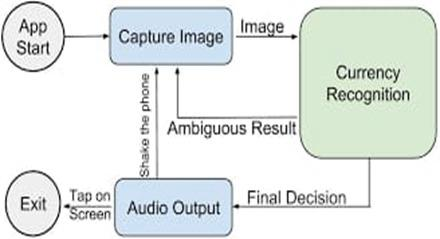
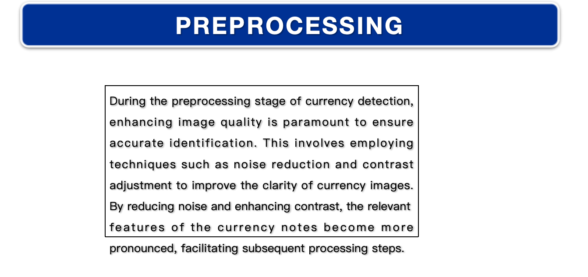
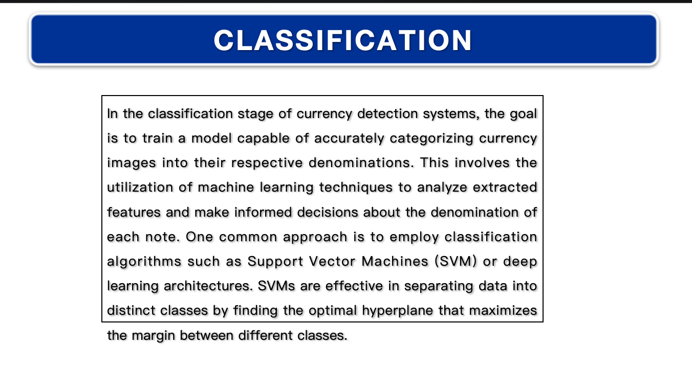
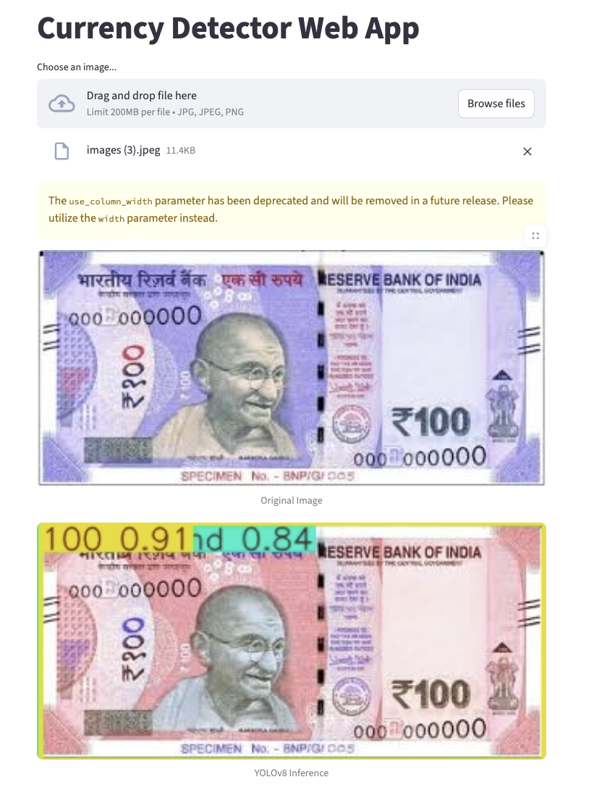
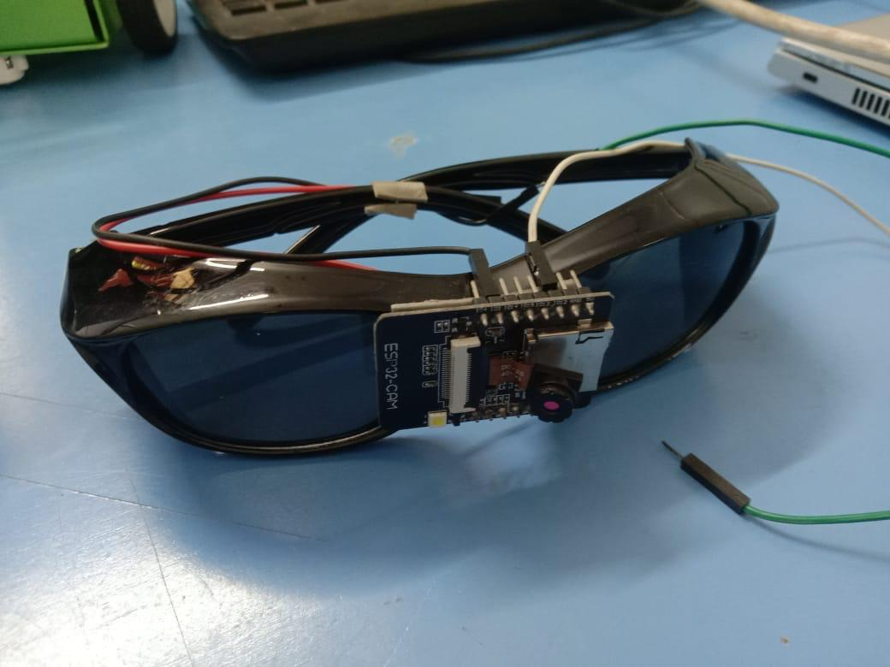
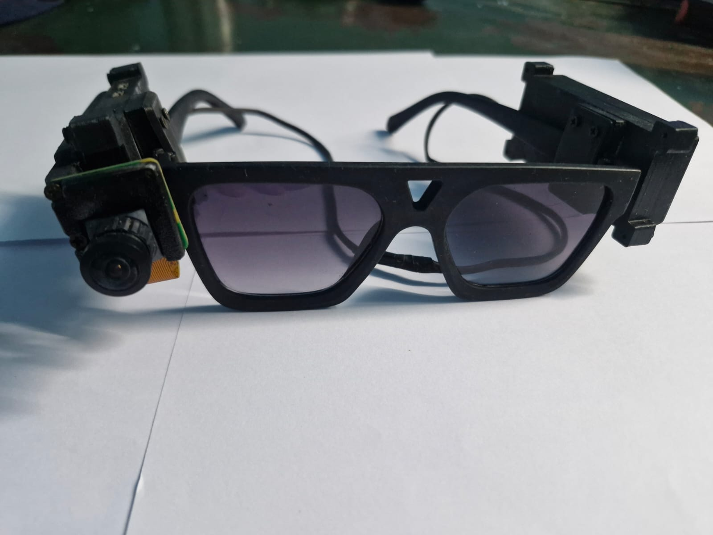

# Blind People Currency Detector

## About

The **Blind People Currency Detector** is an innovative mobile application designed to enhance financial autonomy and inclusivity for individuals with visual impairments. This app utilizes advanced image recognition algorithms to identify and distinguish various currency denominations through the smartphone's camera.

### Project Information

This is an **Ideation Laboratory project** where our team identifies social-related problems and develops innovative solutions to address them. Through collaborative effort and technical expertise, we aim to create assistive technologies that make a meaningful impact on people's lives.

#### Team Members

- **Nasrin Fathima** - Team Leader & Project Coordinator | [GitHub](https://github.com/nasrin-fathima)
- **Siva** - Developer | [GitHub](https://github.com/sivam)
- **Essaki Raja** - Developer | [GitHub](https://github.com/essaki-raja)
- **Caroline Grace** - IoT & Hardware Integration Specialist | [GitHub](https://github.com/caroline-grace)

### Key Features

- **Real-Time Audio Feedback**: Provides instant and accurate information about recognized banknotes via synthetic speech, allowing users to identify currency without external assistance.
- **Offline Operation**: Functions seamlessly without the need for an internet connection, ensuring reliable performance in any environment.
- **User-Friendly Interface**: Features an intuitive design with customizable preferences to cater to individual needs and preferences.
- **Simplicity and Accessibility**: Designed with a focus on ease of use, empowering users to manage their finances independently.

### How It Works

1. **Capture Image**: Point your smartphone camera at a banknote.
2. **Recognition and Analysis**: The app processes the image using sophisticated algorithms to identify the currency.
3. **Audio Feedback**: Receive immediate information about the denomination through synthetic speech.

## System Architecture

Our system follows a comprehensive architecture designed for optimal currency detection and user accessibility.

### Workflow

### Methodology

## Technical Implementation

### Existing System vs Proposed Method

<table>
<tr>
<td></td>
<td></td>
</tr>
<tr>
<td align="center"><b>Existing System</b></td>
<td align="center"><b>Proposed Method</b></td>
</tr>
</table>

### Processing Pipeline

#### Image Acquisition

#### Preprocessing

#### Feature Extraction

#### Image Processing

#### Classification

## User Interface & Output

### Web Interface

### Real-Time Detection
<table>
<tr>
<td></td>
<td></td>
</tr>
</table>

### System Requirements

## Hardware Implementation

Our smart eyeglass prototype integrates the currency detection system for hands-free operation.

<table>
<tr>
<td></td>
<td></td>
</tr>
</table>

### Installation and Usage

To get started with the **Blind People Currency Detector**, simply download the app from your app store and follow the on-screen instructions to set up and customize your preferences. No internet connection is required for the app to function, making it a reliable tool for everyday use.

---

The **Blind People Currency Detector** is dedicated to promoting financial independence and inclusivity for the visually impaired community by harnessing cutting-edge technology and user-centered design.
